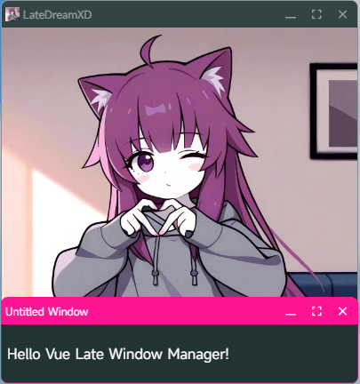

<div align="center">


# Late Window Manager for Vue 3
[](https://www.npmjs.com/package/vue-late-window-manager)
[](https://cn.vuejs.org/)
[](https://github.com/LateDreamXD/vue-late-window-manager/stargazers)
[](https://github.com/LateDreamXD/vue-late-window-manager/issues)

[English](https://github.com/LateDreamXD/vue-late-window-manager#readme) | 中文文档

</div>

## 安装
```bash
npm install vue-late-window-manager --save-dev
# 或
# yarn add vue-late-window-manager --dev
# pnpm add vue-late-window-manager -D
```

## 使用
`main.ts`
```ts
import { createApp } from 'vue'
import App from './App.vue'
import LWM from 'vue-late-window-manager'
// 默认窗口样式
import 'vue-late-window-manager/style'

const app = createApp(App)
app.use(LWM)
app.mount('#app')
```

`App.vue`
```html
<script setup lang="ts">
import { getCurrentInstance, inject } from 'vue';

// 获取 LWM 实例
const $lwm = inject<LWM.Instance>('$lwm')!;

// **不推荐** 或使用 `globalProperties`
// const $lwm = getCurrentInstance()!.appContext.config.globalProperties.$lwm;

// 打开测试窗口
$lwm.actions.openWindow('test-window', {
	content: 'Hello Vue Late Window Manager!'
});
</script>

<template>
	<div>
		<!-- 初始化 LWM 容器 -->
		<LWM />
	</div>
</template>
```
